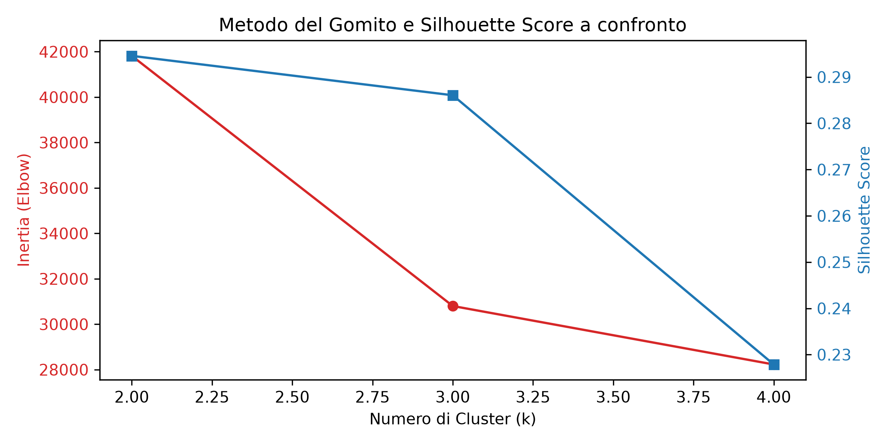
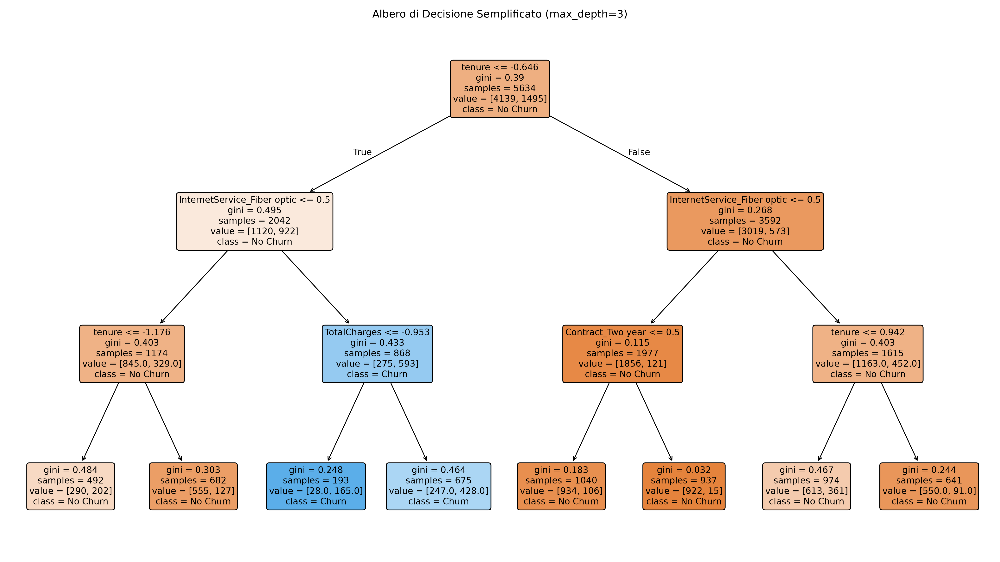
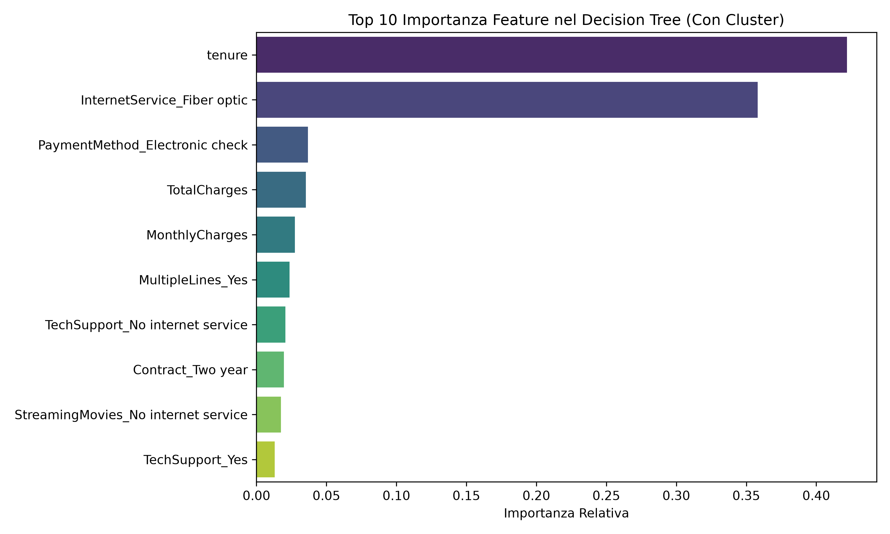

# Progetto di Laboratorio di Intelligenza Artificiale
## Segmentazione Clienti e Churn Prediction (A.A. 2025/2026)

**Studente:** Massimo Mantineo  
**Matricola:** 541924  
**Corso di Laurea:** Informatica (L-31) - Università degli Studi di Messina

---

## 📌 Descrizione del Progetto
Questo progetto implementa una pipeline completa di Machine Learning per l'analisi dei clienti di un operatore di telecomunicazioni, integrando:
1. **Apprendimento Non Supervisionato (Clustering)**: Segmentazione dei clienti tramite l'algoritmo k-Means per individuare gruppi omogenei (profilazione commerciale).
2. **Apprendimento Supervisionato (Classificazione)**: Predizione del tasso di abbandono (*Churn Prediction*) tramite alberi di decisione (Decision Tree) e reti neurali artificiali (Multi-Layer Perceptron - MLP), confrontandoli con una baseline lineare (Regressione Logistica).

L'obiettivo scientifico principale è valutare se e in che misura l'inserimento dell'informazione di clustering non supervisionato migliori le prestazioni dei modelli di classificazione (in particolare per mitigare gli effetti dello sbilanciamento delle classi).

---

## 📂 Organizzazione del Progetto
La struttura delle cartelle è organizzata in modo chiaro e riproducibile:

```text
IA/
├── README.md                          # Questo file (istruzioni e descrizione)
├── requirements.txt                   # Elenco delle librerie Python richieste
├── codice/
│   ├── segmentazione_crunch.ipynb     # Notebook Jupyter principale con il codice
│   └── generate_notebook.py           # Script Python per rigenerare il notebook
├── dati/
│   └── Telco-Customer-Churn.csv       # Dataset utilizzato (scaricato automaticamente)
├── grafici/                           # Grafici ed esportazioni visive generate dal codice
│   ├── churn_distribution.png
│   ├── churn_vs_tenure.png
│   ├── clustering_evaluation.png
│   ├── decision_tree_vis.png
│   └── feature_importances.png
├── relazione/                         # Elaborato scritto e presentazione in LaTeX/PDF
│   ├── relazione.tex                  # Sorgente LaTeX della relazione scritta
│   ├── relazione.pdf                  # PDF della relazione scritta (consigliata 5-10 pagine)
│   ├── presentazione.tex              # Sorgente LaTeX delle slide di presentazione
│   ├── presentazione.pdf              # PDF delle slide di presentazione (9 slide)
│   ├── results_table.tex              # Tabella dei risultati in formato LaTeX
│   ├── results_table.csv              # Tabella dei risultati in formato CSV
│   └── logo_unime_orizontale.png      # Logo dell'Ateneo per header e copertina
├── teoria/                            # Materiale di studio e dispense del corso
└── venv/                              # Ambiente virtuale Python localizzato
```

---

## 🛠️ Requisiti e Librerie Usate
Il progetto richiede **Python 3.8+** e le seguenti librerie principali:
* `numpy` (calcolo vettoriale e gestione array)
* `pandas` (manipolazione e analisi dei dati)
* `matplotlib` e `seaborn` (visualizzazione dati e grafici)
* `scikit-learn` (modelli di ML: KMeans, LogisticRegression, DecisionTreeClassifier, MLPClassifier, e metriche di valutazione)

Tutte le dipendenze con le relative versioni sono elencate in [requirements.txt](requirements.txt).

---

## 🚀 Istruzioni per l'Esecuzione

Per riprodurre ed eseguire il codice del progetto localmente:

### 1. Clonare o posizionarsi nella cartella del progetto
Aprire il terminale e posizionarsi nella root del progetto:
```bash
cd /home/massimo-mantineo/Scrivania/IA
```

### 2. Attivare l'ambiente virtuale (`venv`)
Se l'ambiente virtuale non è attivo, attivarlo usando:
```bash
source venv/bin/activate
```

### 3. Installare le dipendenze
Installare i pacchetti richiesti tramite `pip`:
```bash
pip install -r requirements.txt
```

### 4. Avviare Jupyter Notebook ed eseguire il codice
Per avviare Jupyter e aprire il notebook:
```bash
jupyter notebook codice/segmentazione_crunch.ipynb
```
*Se Jupyter non è installato nell'ambiente virtuale, è possibile installarlo con `pip install jupyter`.*

In alternativa, è possibile eseguire direttamente tutte le celle del notebook convertendolo in uno script Python o tramite l'estensione Jupyter di VS Code.

---

## 📈 Sintesi dei Risultati della Classificazione

| Modello | Feature Scenario | Train Accuracy | Test Accuracy | Train Recall | Test Recall | Train AUC | Test AUC |
| :--- | :--- | :---: | :---: | :---: | :---: | :---: | :---: |
| **Logistic Regression** | Senza Cluster | 0.8053 | 0.8062 | 0.5485 | 0.5588 | 0.8492 | 0.8422 |
| **Logistic Regression** | Con Cluster | 0.8051 | 0.8055 | 0.5485 | 0.5588 | 0.8492 | 0.8423 |
| **Decision Tree** | Senza Cluster | 0.8023 | 0.7942 | 0.5612 | 0.5401 | 0.8476 | 0.8267 |
| **Decision Tree** | Con Cluster | 0.8023 | 0.7942 | 0.5612 | 0.5401 | 0.8476 | 0.8267 |
| **MLP (Rete Neurale)** | Senza Cluster | 0.9143 | 0.7495 | 0.7813 | 0.4278 | 0.9656 | 0.7844 |
| **MLP (Rete Neurale)** | Con Cluster | 0.9104 | 0.7360 | 0.9097 | **0.5829** | 0.9722 | 0.7846 |

### Considerazioni d'esame principali:
* **Logistic Regression & Decision Tree**: Modelli molto stabili, con differenze minime tra Train e Test (nessun segno di overfitting).
* **Multi-Layer Perceptron (MLP)**: Forte presenza di overfitting (Train Accuracy ~91% vs. Test Accuracy ~74%). Tuttavia, l'aggiunta dell'informazione di clustering (Scenario B) ha consentito un incremento notevole della **Recall di Test (+15.5%)**, salendo a **0.5829**, rendendo il modello notevolmente più abile ad individuare i clienti a rischio di abbandono reale.

---

## 📊 Grafici e Visualizzazioni Principali

Per facilitare la comprensione visiva dei dati e dei risultati, di seguito sono riportati i grafici chiave generati dalla pipeline:

### 1. Metodo del Gomito (Inertia) e Silhouette Score per k-Means
Grafico di valutazione per determinare il numero ottimale di cluster ($k=2$).


### 2. Albero di Decisione (Semplificato - max_depth=3)
Struttura decisionale trasparente che mostra le regole di classificazione.


### 3. Top 10 Feature Importances (Scenario B con Clustering)
Mostra l'importanza relativa delle variabili nel determinare il churn, evidenziando il ruolo del Cluster 1.


